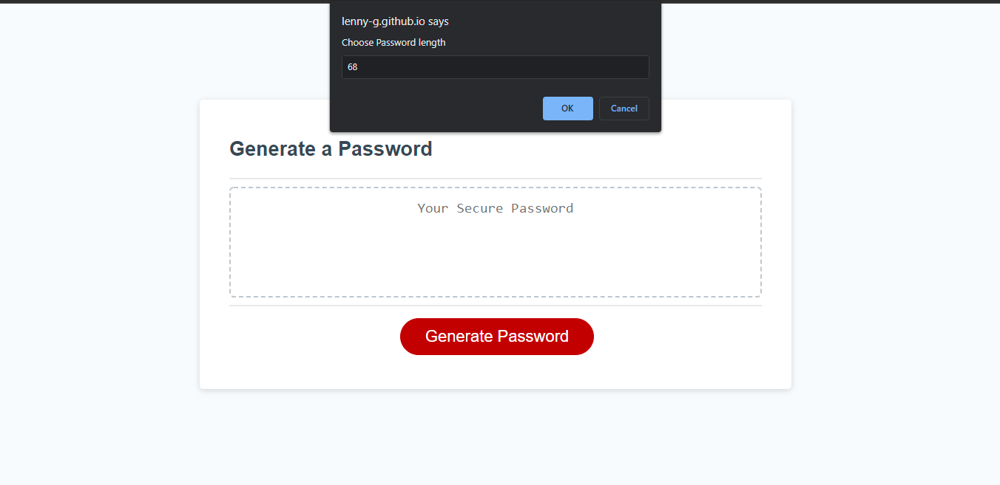
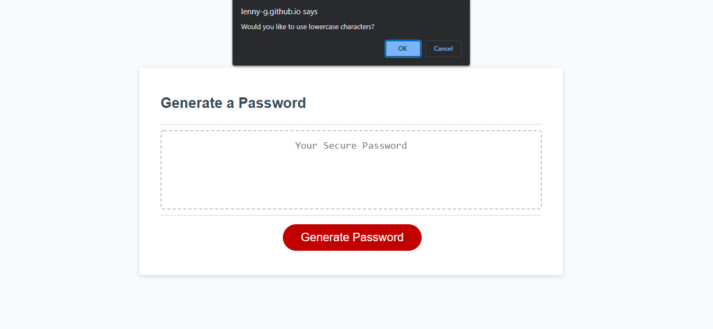
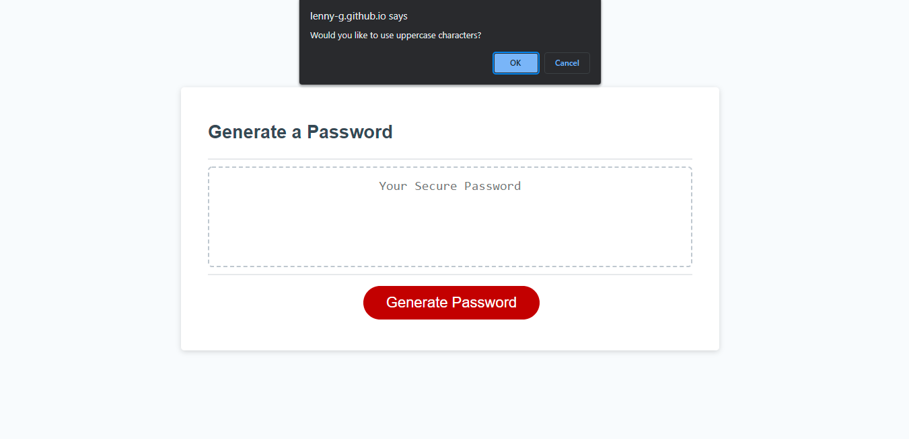
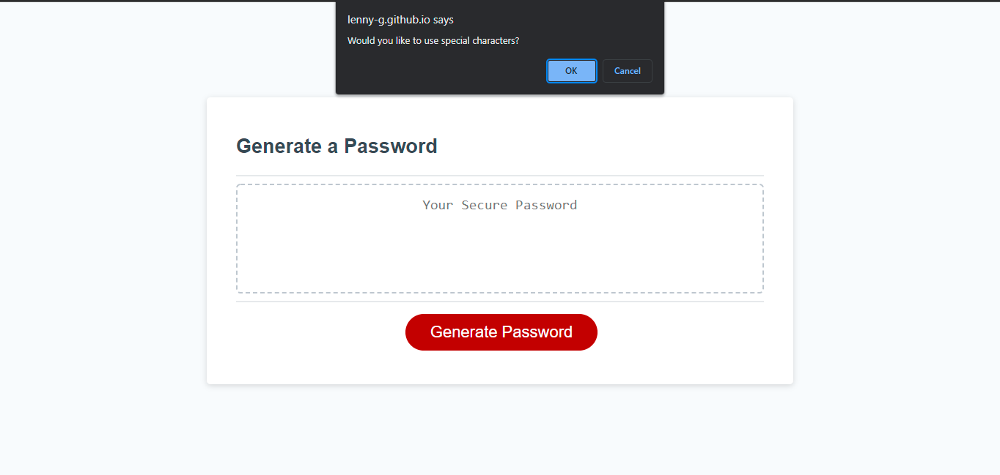
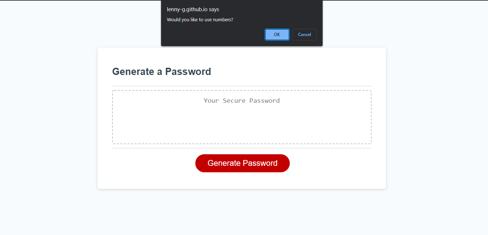
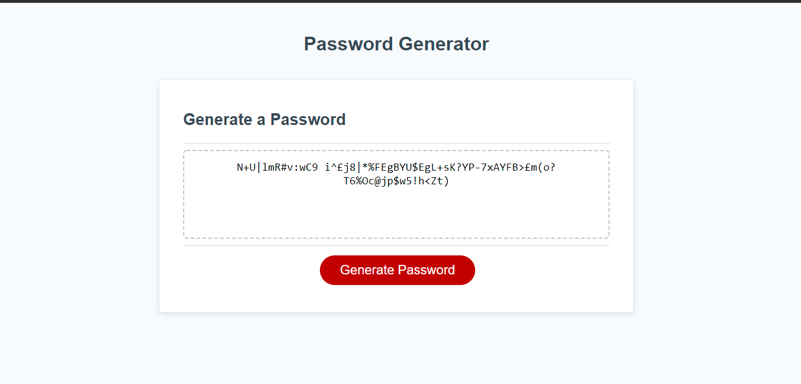
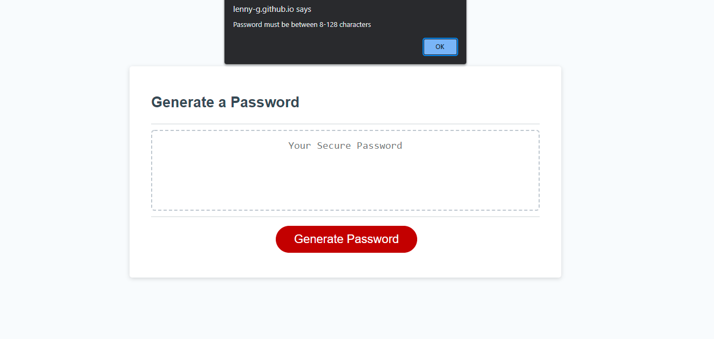
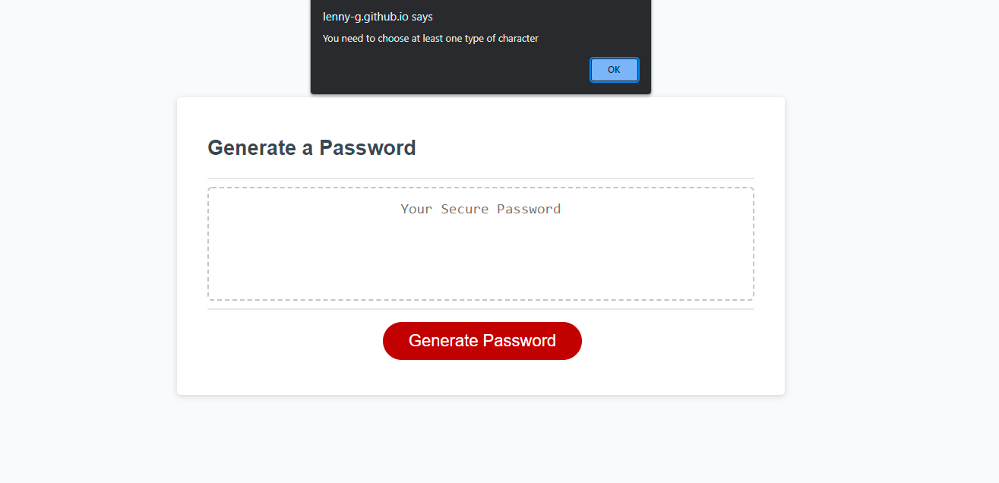

# JAVASCRIPT PASSWORD GENERATOR 

## TABLE OF CONTENTS 
- [Description](#DESCRIPTION)
- [Screenshots](#SCREENSHOTS)
- [Links](#LINKS)
- [Contact](#CONTACT)

## DESCRIPTION

Objective was to create a password generator that generated a random string
from user selected arrays.

## SCREENSHOTS

This screenshot shows the user input their desired password length:

This screenshot shows the option to select lowercase characters:

This screenshot shows the option to select uppercase characters:

This screenshot shows the option to select special characters:

This screenshot shows the option to select numerical characters:

This screenshot shows a generated password using all of the character choices:

This screenshot shows an error message when using a length not within the perimeter of 8-128 characters:

This screenshot shows an error message when none of the character selectors are chosen:

## LINKS

Click [here](https://lenny-g.github.io/javascript-password-generator/) for finished webpage.

## CONTACT

If you would like to contact me regarding this project please reach out to me either on 
[LinkedIn](https://www.linkedin.com/in/leanne-gallagher/) or [GitHub](https://github.com/lenny-g)
